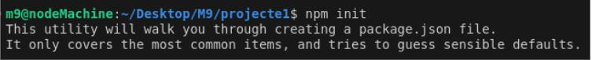

# Descripción del Proyecto  

## Funcionamiento del Proyecto  

Hemos instalado **npm** y creado un proyecto con el comando `npm init -y`.




instalamos dependencias principales con elcomando:

```bash
npm install express body-parser
```
>en este paso instalamos el framework y middelware para procesar datos.

Luego, creamos un archivo `index.js`, que más adelante modificamos y ampliamos para adaptarlo al esquema definido en la práctica anterior.

### Configuración del servidor con ExpressJs

en el fichero **index.js** importamos las librerias necesarias y crea el objeto de la aplicación.

```javaScript
import express from "express";
import fs from "fs";
import bodyParser from "body-parser";

const app = express();
app.use(bodyParser.json());

```
### Funciones para leer y escribir Datos 

Lee de forma sincrónica el archivo db.json, lo convierte de JSON a objeto y lo retorna, manejando errores si ocurren.

```javaScript
const readData = () => {
    try {
        const data = fs.readFileSync("./db.json");
        return JSON.parse(data);
    } catch (error) {
        console.error(error);
    }
};
```
Escribe de forma sincrónica el objeto data en el archivo db.json, convirtiéndolo a formato JSON, y maneja errores si ocurren.

```javaScript
const writeData = (data) => {
    try {
        fs.writeFileSync("./db.json", JSON.stringify(data));
    } catch (error) {
        console.error(error);
    }
};
```
### Archivos JSON  

Hemos creado cuatro ficheros JSON:  

- `Recurso.json`  
- `Reserva.json` (corregido, antes decía "Reserba")  
- `Usuario.json`  
- `Notificacion.json`

Junto a estos ficheros, hemos creado un archivo `index[nomFicher].js` para cada JSON, además de un request HTTP para cada uno de ellos.

### Sintaxis Json

```javaScript

{
    "usuarios": [
        {
            "id": 1,
            "nombre": "Francesc Lara",
            "rol": "MejorProfesor"
        },
        {
            "id": 2,
            "nombre": "Alicia Vazquez",
            "rol": "MejorProfesora"
        }
    ]
}

```


### Peticiones http de pruebas

Cada línea explica brevemente el método HTTP, la URL, lo que se busca (listar, obtener, crear, actualizar o borrar) y el tipo de datos enviado cuando aplica.

```javaScript
GET http://localhost:3000/notificaciones

###

GET http://localhost:3000/notificaciones/2

###

POST http://localhost:3000/notificaciones HTTP/1.1
Content-Type: application/json

{
  "estado": false,
  "dataIn": "20/01/2025",
  "dataFi": "22/02/2025"
}

###
PUT http://localhost:3000/notificaciones/2 HTTP/1.1
Content-Type: application/json

{
  "estado": false,
  "dataIn": "20/01/2025",
  "dataFi": "22/02/2025"
}
###
DELETE http://localhost:3000/notificaciones/3 HTTP/1.1
```

Para evitar reiniciar el servidor manualmente cada vez que hacemos cambios, instalamos **nodemon** con el comando:  

```bash
npm install -g nodemon
```
### Conclusión

Nos ha parecido una maravilla lo potente que esta siendo JavaScript de lado del servidor.

